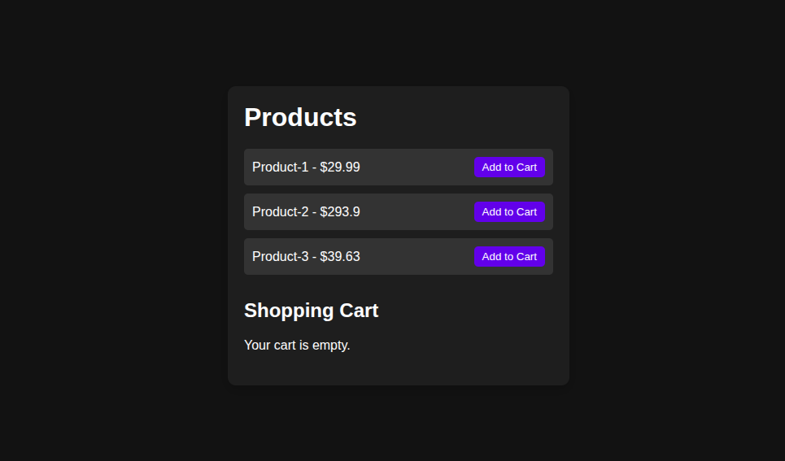
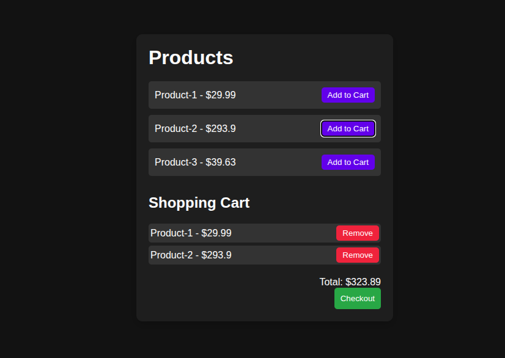

# Simple Shopping Cart (JavaScript)

A beginner-friendly shopping cart web app built using HTML, CSS, and Vanilla JavaScript.  
This project demonstrates how an e-commerce cart works, including dynamic UI updates and data persistence using localStorage.

Live Demo: https://subhajitcodes.github.io/shopping-cart/

### Product Listing Page

### Cart With Items Added

## Features

- Product listing displayed dynamically  
- Add items to the shopping cart  
- Remove individual items from the cart  
- Total price updates automatically  
- Cart data saved using localStorage  
- Checkout clears cart and storage  
- Checkout button disabled when cart is empty  
- Responsive layout for desktop and mobile  

## What I Learned

- DOM manipulation and dynamic UI rendering  
- Event delegation for dynamic elements  
- Managing application state vs UI state  
- Using localStorage to persist data  
- UI rendering pattern (clear and rebuild method)  
- Separation of structure (HTML), style (CSS), and logic (JavaScript)  

## Tech Stack

- HTML5  
- CSS3  
- JavaScript (ES6)  
- Browser localStorage API  

## How It Works

1. Products are displayed dynamically using JavaScript  
2. Clicking "Add to Cart" adds the item to a cart array  
3. The cart UI re-renders every time the cart changes  
4. Cart data is stored in localStorage to survive page refresh  
5. Checkout clears both the UI and localStorage  
